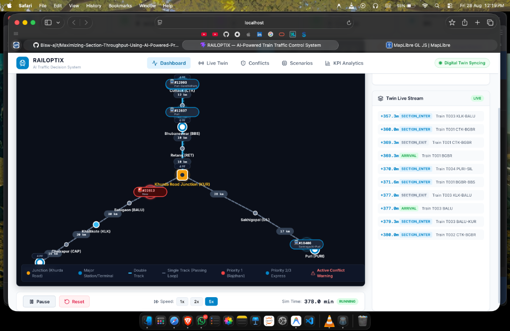
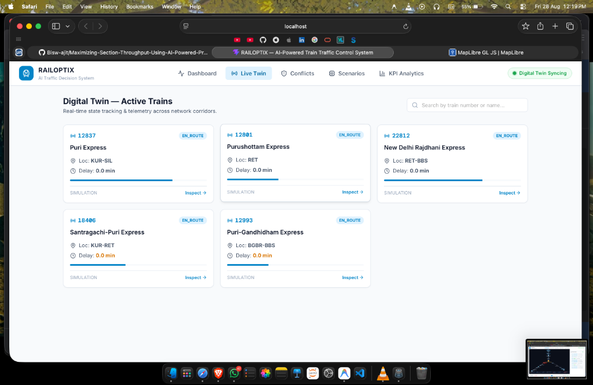
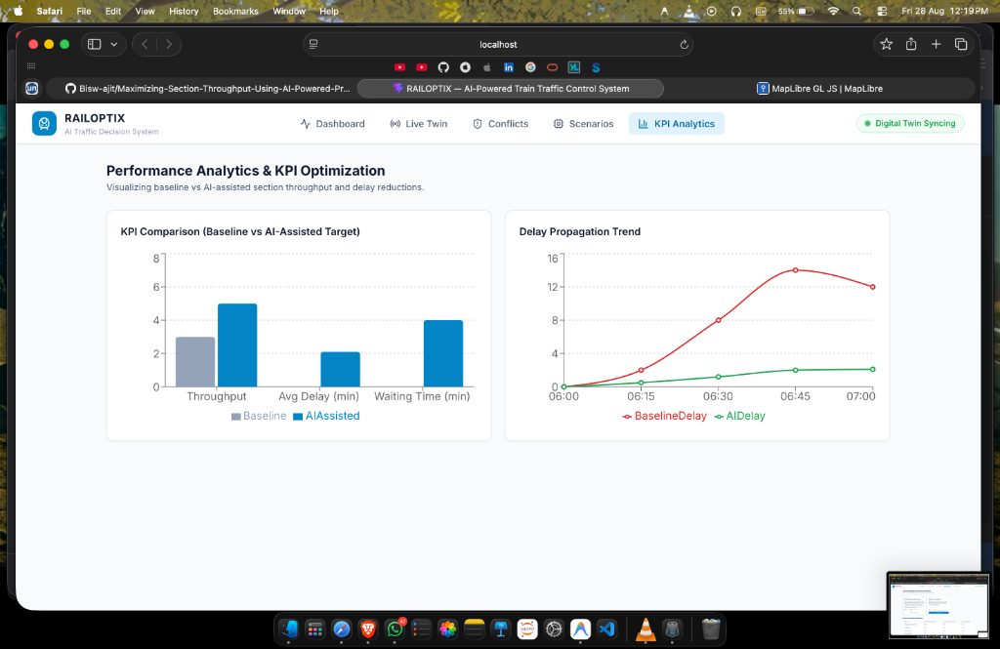
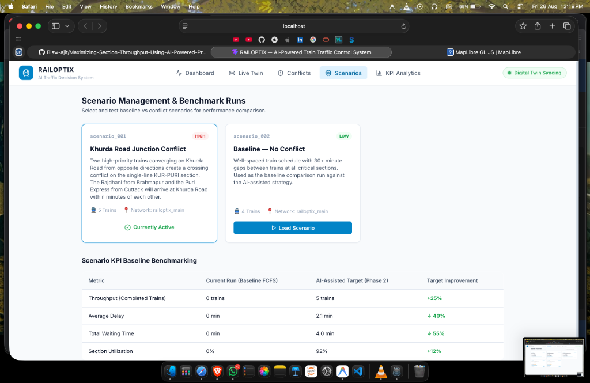
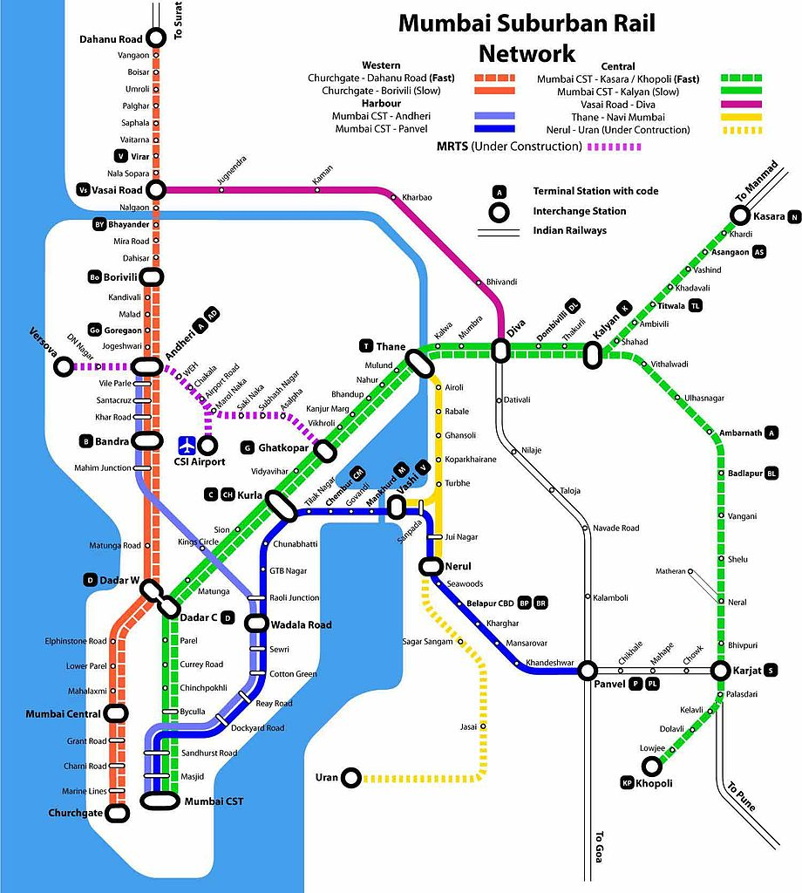

# 🚂 RAILOPTIX — AI-Powered Precise Train Traffic Control System

> **Maximizing Railway Section Throughput & Resolving Network Bottlenecks via Hybrid Digital Twin & SimPy Discrete-Event Simulation Engine**

[](https://www.python.org/)
[](https://fastapi.tiangolo.com/)
[](https://simpy.readthedocs.io/)
[](https://reactjs.org/)
[](https://www.typescriptlang.org/)
[]()

---

## 📑 Table of Contents
- [1. Product Overview](#1-product-overview)
- [2. Key Features & SaaS Highlights](#2-key-features--saas-highlights)
- [3. System UI Snapshots & Feature Showcase](#3-system-ui-snapshots--feature-showcase)
- [4. System Architecture & Digital Twin Methodology](#4-system-architecture--digital-twin-methodology)
- [5. Working Model & Simulation Engine Guide](#5-working-model--simulation-engine-guide)
  - [SimPy Discrete-Event Engine](#simpy-discrete-event-engine)
  - [NetworkX Railway Graph](#networkx-railway-graph)
  - [Digital Twin State Synchronizer](#digital-twin-state-synchronizer)
  - [KPI Calculation & Metrics](#kpi-calculation--metrics)
- [6. Quick Start & Local Setup](#6-quick-start--local-setup)
  - [Prerequisites](#prerequisites)
  - [Backend Setup (FastAPI)](#backend-setup-fastapi)
  - [Frontend Setup (React + Vite)](#frontend-setup-react--vite)
- [7. REST API Documentation](#7-rest-api-documentation)
- [8. Automated Testing & Verification](#8-automated-testing--verification)
- [9. Author & License](#9-author--license)

---

## 1. Product Overview

**RAILOPTIX** is an enterprise-grade railway traffic control decision-support system built around a **hybrid Digital Twin** and a **SimPy discrete-event simulation engine**. 

Designed for high-density railway corridors, RAILOPTIX addresses complex traffic congestion, single-track bottleneck conflicts, and delay propagation across busy junctions like **Khurda Road Junction (KUR)** in India's East Coast Railway network.

> 💡 **Core Design Principle**:  
> *"Live data tells us what is happening now. Simulation tells us what could happen next. AI & optimization recommends what should be done."*

### 🗺️ Network Topology Covered
The MVP models the high-density **Cuttack–Bhubaneswar–Khurda Road–Puri** & **Khurda Road–Brahmapur** corridors:

```text
                  CTK (Cuttack)
                       │
                 BGBR (Barang)
                       │
               BBS (Bhubaneswar)
                       │
                 RET (Retang)
                       │
            KUR (Khurda Road Junction)
             ┌─────────┴─────────┐
             │                   │
      (Puri Branch)     (Brahmapur Mainline)
       SIL (Sakhigopal)     BALU (Balugaon)
             │                   │
        PURI (Puri)       KLK (Khallikote)
                                 │
                          CAP (Chatrapur)
                                 │
                          BAM (Brahmapur)
```

---

## 2. Key Features & SaaS Highlights

- 🖥️ **Central Control Room CTC Dispatch Board**: High-contrast, SVG-based schematic dispatch board featuring dark mode CTC aesthetics, single/double track markers, and instant section distance badges.
- ⚡ **Real-Time Multi-Train Movement**: Simultaneous animated movement of trains (*Rajdhani Express #22812*, *Puri Express #12837*, *Purushottam Express #12801*) with live speed, direction arrows, and priority color coding.
- 🚨 **Conflict Warning System**: Automatic glowing highlight of single-track bottlenecks (e.g. `KUR-PURI`) when crossing conflicts or multi-train occupancies occur.
- 📊 **Real-Time Telemetry & KPI Analytics**: Instant tracking of **Throughput**, **Average Delay (minutes)**, **Total Waiting Time**, and **Section Utilization %**.
- 🎛️ **SimPy Discrete-Event Simulation Engine**: Real-time simulation control allowing **Start**, **Pause**, **Resume**, **Reset**, and variable speed multipliers (`1x`, `2x`, `5x`).
- 🔄 **Multi-Theme Canvas**: Toggle seamlessly between **CTC Dark Mode** (Control Room Dispatcher), **Transit Map** (Suburban Schematic), and **Geographic Lat/Lng View**.

---

## 3. System UI Snapshots & Feature Showcase

### 🔴 1. Central Control Room — Live CTC Dispatch Board
*Interactive schematic dispatch map displaying real-time simultaneous movement of active express and passenger trains, section occupancies, and twin live event stream.*



---

### 🚊 2. Digital Twin — Active Train Telemetry
*Real-time state tracking and telemetry cards for all scheduled and en-route trains across network corridors.*



---

### 📊 3. Performance Analytics & KPI Optimization
*Visual analytics comparing baseline FCFS performance against AI-assisted throughput targets and delay propagation trends.*



---

### ⚙️ 4. Scenario Management & Benchmarking
*Scenario loader interface for testing baseline vs conflict scenarios with automatic KPI target projections.*



---

### 🗺️ 5. Suburban Transit Schematic Diagram Reference
*Clean transit diagram reference styling integrated into the interactive vector map canvas.*



---

## 4. System Architecture & Digital Twin Methodology

RAILOPTIX uses a decoupled, high-performance architecture built on Python (FastAPI/SimPy) and React (Vite/TypeScript):

```text
  ┌──────────────────────────────────────────────────────────┐
  │                 React / Vite Dashboard UI                │
  │     (Schematic SVG Map, KPI Bar, Simulation Controls)    │
  └────────────────────────────┬─────────────────────────────┘
                               │ REST API / JSON
                               ▼
  ┌──────────────────────────────────────────────────────────┐
  │                  FastAPI Backend Server                  │
  │    (Scenarios Router, Simulation API, Twin State API)    │
  └──────────────┬────────────────────────────┬──────────────┘
                 │                            │
                 ▼                            ▼
  ┌─────────────────────────────┐  ┌─────────────────────────────┐
  │    Digital Twin State       │  │ SimPy Simulation Engine     │
  │ (Thread-Safe Memory Store,  │  │  (Discrete-Event Process,   │
  │  TrainState, Occupancy)     │  │   Capacity Resources)       │
  └──────────────┬──────────────┘  └──────────────┬──────────────┘
                 │                                │
                 └──────────────┬─────────────────┘
                                │
                                ▼
                 ┌──────────────────────────────┐
                 │    NetworkX Graph Model      │
                 │ (11 Nodes, 10 Track Sections)│
                 └──────────────────────────────┘
```

---

## 5. Working Model & Simulation Engine Guide

### SimPy Discrete-Event Engine
The simulation engine ([`engine.py`](file:///Users/biswajit/Downloads/CLG%20PROJECT/7th%20sem/model/railoptix/backend/simulation/engine.py)) uses **SimPy** to model trains as autonomous processes competing for capacity-constrained section resources:

```python
# Each section is modeled as a capacity-limited SimPy Resource
for section_id, section in network.sections.items():
    capacity = section.get("capacity", 1)
    self.section_resources[section_id] = simpy.Resource(self.env, capacity=capacity)
```

Each train agent ([`train_agent.py`](file:///Users/biswajit/Downloads/CLG%20PROJECT/7th%20sem/model/railoptix/backend/simulation/train_agent.py)):
1. Waits until its scheduled departure time in simulation minutes.
2. Requests section access (blocks if the single-line section is already occupied by another train).
3. Travels through the section at simulated speed:  
   $$\text{Travel Minutes} = \left(\frac{\text{Section Length (km)}}{\text{Speed (km/h)}}\right) \times 60$$
4. Emits real-time telemetry events (`SECTION_ENTER`, `SECTION_EXIT`, `ARRIVAL`, `HELD`, `COMPLETED`).
5. Updates Digital Twin `journey_progress` (smooth 0.0 → 1.0 interpolation for smooth UI movement).

### NetworkX Railway Graph
The railway network ([`network_graph.py`](file:///Users/biswajit/Downloads/CLG%20PROJECT/7th%20sem/model/railoptix/backend/services/twin/network_graph.py)) is represented as a directed graph (`nx.DiGraph`):
- **Nodes (11)**: Station platforms, junctions, and intermediate passing loops.
- **Sections (10)**: Double-track and single-track line segments with physical length, capacity, and direction rules.
- **Routes (5)**: Ordered node sequences defining train paths (e.g. `route_A`: CTK → BBS → KUR → PURI).

### Digital Twin State Synchronizer
The Digital Twin ([`digital_twin.py`](file:///Users/biswajit/Downloads/CLG%20PROJECT/7th%20sem/model/railoptix/backend/services/twin/digital_twin.py)) provides a thread-safe, in-memory store tracking active train locations, staleness, data source (`LIVE` / `SIMULATION`), and section occupancy.

### KPI Calculation & Metrics

| Metric | Calculation / Definition | Target |
|---|---|---|
| **Throughput** | Count of trains that successfully reached their final terminal destination | Maximize |
| **Average Delay** | $$\frac{\sum (\text{Simulated Arrival} - \text{Scheduled Arrival})}{\text{Total Trains}}$$ | Minimize |
| **Waiting Time** | Total cumulative minutes trains spent held at single-line sections | Minimize |
| **Track Utilization** | $$\frac{\text{Completed Trains}}{\text{Total Trains Scenario}}$$ | Maximize |

---

## 6. Quick Start & Local Setup

### Prerequisites
- **Python**: `3.10` or higher
- **Node.js**: `18.0` or higher
- **Package Managers**: `pip` & `npm`

---

### Backend Setup (FastAPI)

1. Navigate to the repository root directory:
   ```bash
   cd railoptix
   ```

2. Create and activate a Python virtual environment:
   ```bash
   python3 -m venv .venv
   source .venv/bin/activate
   ```

3. Install required Python packages:
   ```bash
   pip install -r backend/requirements.txt
   ```

4. Start the FastAPI Uvicorn backend server:
   ```bash
   .venv/bin/python3 -m uvicorn backend.main:app --host 0.0.0.0 --port 8000
   ```

- **Backend API**: `http://127.0.0.1:8000`
- **Swagger Interactive API Docs**: `http://127.0.0.1:8000/docs`

---

### Frontend Setup (React + Vite)

1. Open a new terminal and navigate to the frontend directory:
   ```bash
   cd railoptix/frontend
   ```

2. Install Node dependencies:
   ```bash
   npm install
   ```

3. Start the Vite development server:
   ```bash
   npm run dev
   ```

- **Frontend Dashboard**: `http://localhost:5173`

---

## 7. REST API Documentation

| Method | Endpoint | Description |
|---|---|---|
| `GET` | `/api/network` | Returns full railway network topology (nodes, sections, routes) |
| `GET` | `/api/twin/state` | Returns live Digital Twin state (train positions, delays, occupancy) |
| `GET` | `/api/scenarios` | Lists all loaded railway scenario definitions |
| `POST` | `/api/scenarios/load` | Loads a scenario into Digital Twin & Simulation Engine |
| `POST` | `/api/simulation/start` | Starts discrete-event simulation engine |
| `POST` | `/api/simulation/pause` | Pauses running simulation |
| `POST` | `/api/simulation/reset` | Resets simulation engine & Digital Twin to idle state |
| `POST` | `/api/simulation/speed` | Sets speed multiplier (`{"multiplier": 5.0}`) |
| `GET` | `/api/simulation/status` | Returns simulation clock tick, status, and completed trains count |
| `GET` | `/api/simulation/kpis` | Returns real-time KPIs (throughput, average delay, waiting time) |
| `GET` | `/api/simulation/events` | Streams simulation event log (`SECTION_ENTER`, `ARRIVED`, `HELD`) |

---

## 8. Automated Testing & Verification

RAILOPTIX includes an automated test suite verifying network graph loading, scenario validation, timetable calculation, and Digital Twin state management.

To run tests:
```bash
cd railoptix
PYTHONPATH=. .venv/bin/python3 tests/test_phase1_core.py
```

Expected Output:
```text
Ran 3 tests in 0.004s

OK
```

---

## 9. Author & License

- **Author**: Biswajit ([@Bisw-ajit](https://github.com/Bisw-ajit))
- **Project Type**: 4th-Year Major Engineering Project (7th Semester)
- **License**: MIT License — free for academic and research use.
